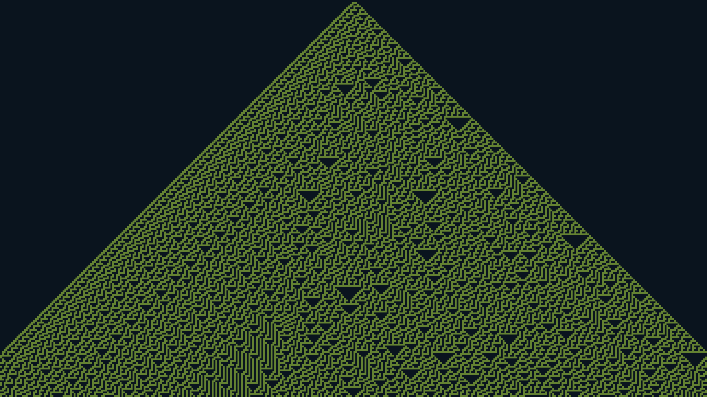

# Elementary Cellular Automaton visualizer using pygame.

This module implements a scrolling 1D cellular automaton where each
generation is drawn as a horizontal row of pixels. The automaton evolves
according to a Wolfram-style 3-cell neighbourhood rule (0-255), and the
simulation resets with a new random ruleset once the screen is filled.

The code is an updated OOP version of David Colson's original
example:

    https://github.com/DavidColson/CellularAutomata

The neighbour evaluation uses bit shifts to compute the rule index
efficiently, replacing the original string-based binary conversion.
Additional helpers separate initialization, rule decoding, generation
updates, and rendering to make the logic easier to read and extend.

---

## Installation

### 1. Clone the repository

```bash
git clone git@github.com:Dyretna/pygame_automata.git
cd pygame_automata
```

### 2. Install in editable mode
Editable mode makes the package importable while you develop:

```bash
pip install -e .
```

This uses the pyproject.toml configuration and installs the package
located under src/pygame_automata.

### 3. Set path in .env
This project uses python-dotenv to get easy access to paths, for example
when saving visualisations. To make use of it, create a .env file and add
path to project root folder:

```
PROJECT_ROOT=/home/User/Dokument/<path to project...>/pygame_automata
```


## Usage

This launches the basic 1D cellular automaton with default configuration.

### Run using the CLI interface

```bash
python -m pygame_automata.cli
```

The CLI allows overriding configuration parameters such as rule, text-to-rule,
window size, fullscreen, colors, and timing. run with help flag to see current options.

```bash
python -m pygame_automata.cli --help
```


## Planned Features
- Full pygame UI with buttons
- Pause / resume
- Step forward / backward
- Color picker + random palettes
- Save screenshot
- word‑to‑rule input
- Auto‑run toggle
- Multiple render modes
